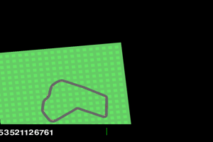
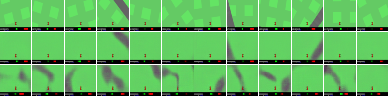
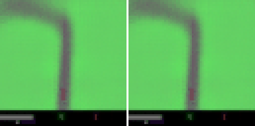

# world-model

A **World Model** for CarRacing-v3 — VAE + MDN-RNN + CMA-ES controller, all from scratch in PyTorch. Reproduces Ha & Schmidhuber (2018) on 2026 hardware (Apple Silicon / MPS).



*Trained agent driving a full track — 881 return, 867-parameter controller, 30 minutes of training.*

---

## What this is

Three neural networks that together learn a compressed simulator of a driving environment, plus a tiny agent trained inside it:

1. **VAE** compresses each 64×64×3 frame into a 32-dim latent `z`
2. **MDN-RNN** predicts `p(z_{t+1}, reward | z_t, action)` — this is "the dream"
3. **Controller** maps `[z_t; h_t]` → action, trained with CMA-ES in the real env

```
           +-------+     +---------+     +-----------+
  obs ---> |  VAE  | --> | MDN-RNN | --> | Controller| --> action
  (96x96)  |encoder|  z  |  LSTM   |  h  |  Linear   |    (steer,
           +-------+     +---------+     +-----------+     gas, brake)
               ^              |
               |          next latent (dream)
               +---- decoder -+
```

Total parameters: **~4.7M**. The controller itself is only **867 params**.

---

## Results

| Stage | Metric | Value |
|---|---|---|
| VAE reconstruction (10 epochs) | pixel MSE per image | 19.5 |
| MDN-RNN dynamics (20 epochs) | GMM NLL | 36.0 |
| Controller (CMA-ES, 30 gens) | **best single-episode return** | **881** |
| Controller mean over 5 episodes | average return | 325 |

CarRacing-v3 is considered "solved" at 900+.

### VAE reconstructions



Top row: originals. Middle row: VAE reconstructions. Bottom row: samples from the prior `z ~ N(0, I)` — the decoder hallucinates plausible new tracks, showing the model learned a real manifold of the environment.

### Dream rollout vs real



Left: real episode (VAE-decoded). Right: 80-step autoregressive "dream" — primed with one real latent, the MDN-RNN predicts every subsequent latent, each decoded back through the VAE. The dream tracks reality for the full sequence.

---

## Stack

- Python 3.12 (native arm64)
- PyTorch 2.11 with MPS backend (Apple Silicon GPU)
- Gymnasium 1.3 (CarRacing-v3, Box2D)
- pycma 4.4 for evolution strategies

All training runs on a laptop. Full pipeline takes ~35 minutes on an M3 Pro.

---

## Reproduce

```bash
# Setup (requires native arm64 Python on Apple Silicon)
/opt/homebrew/bin/python3.12 -m venv .venv
source .venv/bin/activate
pip install -r requirements.txt
python scripts/sanity_check.py

# 1. Collect 200 episodes of random rollouts (~5 min)
python scripts/collect_rollouts.py --num-episodes 200 --max-steps 500

# 2. Train VAE on 95K frames (~7 min)
python scripts/train_vae.py --epochs 10 --batch-size 128
python scripts/visualize_vae.py

# 3. Encode rollouts to latents, train MDN-RNN (~4 min)
python scripts/encode_rollouts.py
python scripts/train_mdn_rnn.py --epochs 20 --seq-len 32

# 4. Visualize dream rollouts (real vs dreamed side-by-side)
python scripts/dream_rollout.py

# 5. Train controller with CMA-ES in the real env (~20 min)
python scripts/train_controller.py --generations 30 --popsize 16

# 6. Evaluate and record gameplay GIF
python scripts/evaluate_controller.py --n-episodes 5 --gif-seed 1044

# 7. Optional: watch the agent drive live in a pygame window
python scripts/play_live.py --episodes 3
```

---

## Layout

```
world-model/
├── src/world_model/
│   ├── vae.py              Convolutional VAE
│   ├── mdn_rnn.py          LSTM + Mixture Density head
│   ├── controller.py       867-param linear policy
│   ├── data.py             frame dataset
│   └── latent_data.py      sequence dataset for MDN-RNN
├── scripts/
│   ├── sanity_check.py
│   ├── collect_rollouts.py
│   ├── train_vae.py
│   ├── visualize_vae.py
│   ├── encode_rollouts.py
│   ├── train_mdn_rnn.py
│   ├── dream_rollout.py
│   ├── train_controller.py
│   ├── evaluate_controller.py
│   └── play_live.py
├── assets/                 rendered artifacts (PNGs and GIFs)
├── requirements.txt
└── README.md
```

---

## References

- [World Models — Ha & Schmidhuber (2018)](https://worldmodels.github.io/)
- [DreamerV3 — Hafner et al. (2023)](https://arxiv.org/abs/2301.04104)
- [pycma — Hansen et al.](https://github.com/CMA-ES/pycma)

---

## Author

Abhishek Shekhar — [@Abhi183](https://github.com/Abhi183)
